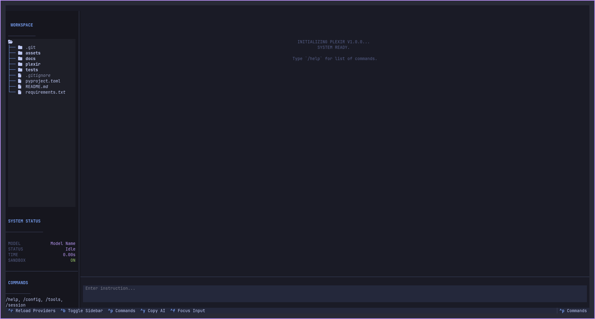

# Plexir 🌌

**Plexir** is a modular, secure, and beautiful AI-powered terminal workspace. Designed for developers who live in the CLI, it combines multi-provider LLM orchestration, advanced agentic tools, and a secure, persistent Docker sandbox into a single keyboard-centric interface.



[](https://github.com/pomilon/plexir)
[](https://opensource.org/licenses/MIT)

---

## 🚀 Features

- **Multi-Provider Failover**: Seamlessly switch between Gemini, Groq, and OpenAI-compatible APIs. If one model hits a quota, Plexir automatically fails over to the next in your priority list.
- **Smart Retries**: Intelligently detects transient rate limits (429s) and retries with a delay, while instantly falling back for hard resource exhaustion.
- **Persistent Docker Sandbox**: Launch with `--sandbox` to give the AI its own persistent Linux "computer." All tools (file system, git, shell) are automatically redirected inside the container.
- **Smart Agent Capabilities**:
    - **RAG & Context**: `codebase_search` allows natural language queries across your codebase. `get_definitions` quickly maps file structures.
    - **Planning**: Built-in `scratchpad` memory for long-term planning and note-taking.
    - **Visual Safety**: Critical actions like writing files show a **Rich Visual Diff** (Red/Green) in the confirmation modal before execution.
- **Advanced Agentic Tools**:
    - **Filesystem**: `read_file`, `write_file`, `list_directory`, `edit_file` (precise patching).
    - **Git Suite**: `git_status`, `git_diff`, `git_add`, `git_commit`, `git_checkout`, `git_branch`.
    - **Web Capabilities**: `web_search` (DuckDuckGo) and `browse_url` (content extraction).
    - **Code Execution**: `python_sandbox` for isolated logic testing.
- **Human-in-the-Loop (HITL)**: Safety first. Critical actions require explicit user confirmation.
    - **Visual Diffs**: Review changes before they happen.
    - **Skip/Stop**: Granular control to skip a specific tool or stop the entire process.
- **Modern TUI**: Built with [Textual](https://textual.textualize.io/), featuring:
    - **Collapsible Tool Outputs**: Keep your chat clean while preserving execution details.
    - **Dynamic Themes**: `tokyo-night`, `hacker`, `plexir-light`.
    - **Live Workspace**: Real-time file tree updates.
    - **Command Palette**: `Ctrl+P` for quick actions.
- **Macros & Sessions**: Record complex workflows into macros and persist chat histories across sessions.

---

## 📦 Installation

### Prerequisites
- Python 3.10 or higher.
- [Docker](https://www.docker.com/) (Required for Sandbox mode).

### Setup
1. Clone the repository:
   ```bash
   git clone https://github.com/pomilon/plexir.git
   cd plexir
   ```
2. Install globally (allows running `plexir` from anywhere):
   ```bash
   pip install -e .
   ```

---

## 🛠 Usage

Start Plexir from any terminal:
```bash
plexir
```

Launch in **Persistent Sandbox** mode:
```bash
plexir --sandbox
```

### Keyboard Shortcuts
- `Ctrl+P`: Open Command Palette (Switch themes, etc.)
- `Ctrl+B`: Toggle Sidebar
- `Ctrl+F`: Focus Input
- `Ctrl+Y`: Copy last AI response to clipboard
- `Ctrl+R`: Reload providers from config
- `Ctrl+C`: **Interrupt Generation** (if running) or Quit

### Slash Commands
- `/config list`: View current providers and order.
- `/config set "Provider Name" api_key YOUR_KEY`: Set an API key.
- `/session save [name]`: Save the current chat.
- `/macro record [name]`: Start recording a new macro.
- `/help`: Show all available commands.

---

## ⚙️ Configuration

Plexir stores its configuration in `~/.plexir/config.json`. You can manage this file manually or using the in-app `/config` commands. 

Example failover hierarchy:
1. **Gemini Primary** (Gemini 3 Flash Preview)
2. **Gemini Fallback** (Gemini 2.5 Flash)
3. **Groq Backup** (gpt-oss-120b)

---

## 📄 Documentation

Detailed guides are available in the `docs/` directory:
- [Getting Started](docs/getting_started.md)
- [Tool Reference](docs/tools.md)
- [Sandbox Environment](docs/sandbox.md)
- [Configuring Providers](docs/configuration.md)

---

## 🤝 Contributing

Contributions are welcome! Please see our [Contributing Guidelines](CONTRIBUTING.md) and [Code of Conduct](CODE_OF_CONDUCT.md) for more details.

## 🛡️ Security

If you discover a security vulnerability, please see our [Security Policy](SECURITY.md).

## ⚖️ License

Plexir is released under the [MIT License](LICENSE).